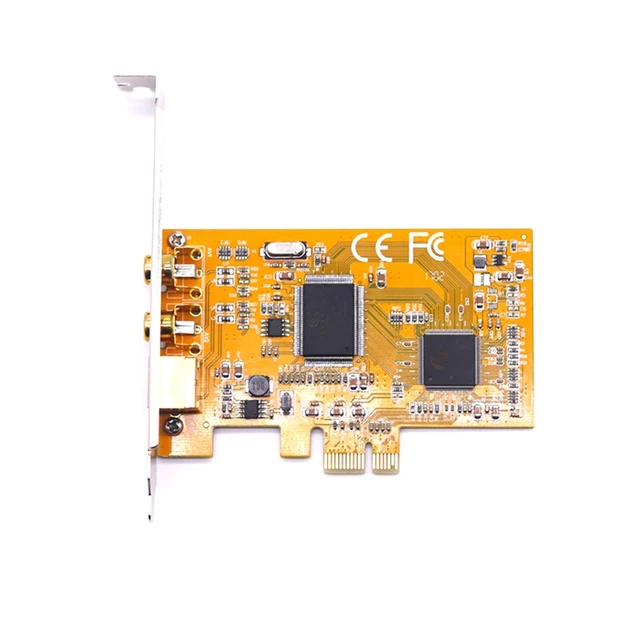
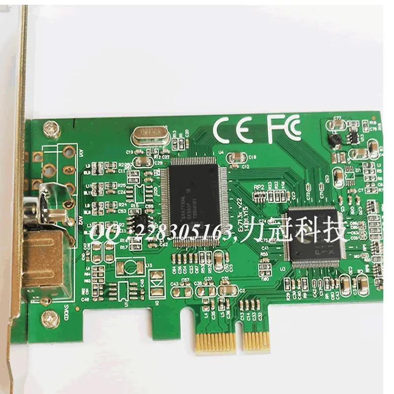

# Windows Drivers for "Noname AliExpress PCI/PCIE capture cards"

Here is a collection of drivers for video capture cards that you can buy on AliExpress.
If you're like me and ended up with a card that Windows detects as an unknown device, these drivers might help you out.

## Supported Cards and Chipsets

These drivers support cards with the following chipsets:

- Conexant CX8800
- Conexant CX8810
- Conexant CX23883
- Conexant CX23885
- Conexant CX23888

These cards can come in any color: white, yellow, green, blue, or whatever.
They may have different inputs: RCA, S-VIDEO, VGA, and may use either PCI or PCI-e.

> Inputs don't matter — what matters is the chip.
> You need to look at the physical chip on the card — it should be labeled with the model name.

  

These drivers have been tested on the card shown in the first photo and worked like a charm.

> ⚠️ I am not the author of these drivers and can't guarantee that they will work with your capture card.
> I'm just sharing what helped me, hoping it saves you time and frustration.

## Installation
To install on Windows:

#### 1. Open Device Manager
  - Press Win + X on your keyboard.
  - Select Device Manager from the menu.

or

  - Press Win + R to open the Run dialog.
  - Type devmgmt.msc and press Enter.
  - Find the Device

#### 2. In Device Manager, look for a category called "*Other devices*".
  - Expand it by clicking the small arrow (▶).
  - Look for any device with a yellow exclamation mark — this means the driver is missing or not working.

#### 3. Install the Driver
  - Right-click the problematic device.
  - Choose Update driver.
  - Select "Browse my computer for drivers".
  - Set the path to the folder where you downloaded or cloned this repository.

> ✅ Don’t forget to check the box labeled "Include subfolders" so that Windows can search inside all subdirectories.

## Alternative Drivers

There are also some alternative CXADC drivers that allow you to get raw data from these cards and use it however you like.

[For Linux](https://github.com/happycube/cxadc-linux3) — By default, you don’t need any drivers for these cards in Linux — they just work.
But if you want advanced features, you can try this one.

[For Windows](https://github.com/JuniorIsAJitterbug/cxadc-win) — If you want to use the CXADC driver on Windows, make sure to remove the driver from this repo first.

You may run into driver signature issues — if so, try enabling Test Mode or temporarily disabling driver signature enforcement. Also you will need to build it from source, you can use either **github actions** for that (but you will need to fork that repo first) or do it on your PC.
